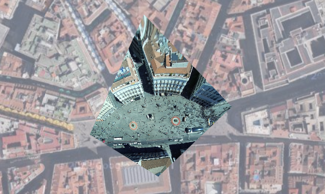

Leaflet.DistortableImage
===================

[](https://travis-ci.org/publiclab/Leaflet.DistortableImage)

A Leaflet extension to distort images -- "rubbersheeting" -- for the [MapKnitter.org](http://mapknitter.org) ([src](https://github.com/publiclab/mapknitter)) image georectification service by [Public Lab](http://publiclab.org). Leaflet.DistortableImage allows for perspectival distortions of images, client-side, using CSS3 transformations in the DOM. 

Advantages include:

* it can handle over 100 images smoothly, even on a smartphone. 
* images can be right-clicked and downloaded individually in their original state
* CSS3 transforms are GPU-accelerated in most (all?) browsers, for a very smooth UI
* no need to server-side generate raster GeoTiffs, tilesets, etc in order to view distorted imagery layers
* images use DOM event handling for real-time distortion 

[Download as zip](https://github.com/publiclab/Leaflet.DistortableImage/releases) or clone to get a copy of the repo.

This plugin has basic functionality, and is in production as part of MapKnitter, but there are [plenty of outstanding issues to resolve](https://github.com/publiclab/Leaflet.DistortableImage/issues). Please consider helping out!

The recommended Google satellite base layer can be integrated using this Leaflet plugin: https://gitlab.com/IvanSanchez/Leaflet.GridLayer.GoogleMutant

Here's a screenshot:



## Demo

Check out this [simple demo](https://publiclab.github.io/Leaflet.DistortableImage/examples/index.html).

And watch this GIF demo:


To test the code, open `index.html` in your browser and click and drag the markers on the edges of the image. The image will show perspectival distortions.

## Usage

```js
// basic Leaflet map setup
map = new L.map('map').setView([51.505, -0.09], 13);
L.tileLayer('https://{s}.tiles.mapbox.com/v3/anishshah101.ipm9j6em/{z}/{x}/{y}.png', {
  maxZoom: 18,
  attribution: 'Map data &copy; <a href="http://openstreetmap.org">OpenStreetMap</a> contributors, ' +
    '<a href="http://creativecommons.org/licenses/by-sa/2.0/">CC-BY-SA</a>, ' +
    'Imagery © <a href="http://mapbox.com">Mapbox</a>',
  id: 'examples.map-i86knfo3'
}).addTo(map);

// create an image
img = new L.DistortableImageOverlay(
  'example.png', {
    corners: [
      new L.latLng(51.52,-0.10),
      new L.latLng(51.52,-0.14),
      new L.latLng(51.50,-0.10),
      new L.latLng(51.50,-0.14)
    ],
    fullResolutionSrc: 'large.jpg' // optionally pass in a higher resolution image to use in full-res exporting
  }
).addTo(map);

L.DomEvent.on(img._image, 'load', img.editing.enable, img.editing); // enable editing

```

## Full-resolution download

We've added a GPU-accelerated means to generate a full resolution version of the distorted image; it requires two additional dependencies to enable; see how we've included them in the demo:


```
<script src="../node_modules/webgl-distort/dist/webgl-distort.js"></script>
<script src="../node_modules/glfx-js/dist/glfx.js"></script>
```

****

## Setup

1. From the root directory, run `npm install` or `sudo npm install`
2. Open examples/index.html in a browser

## Contributing

1. This project uses `grunt` to do a lot of things, including concatenate source files from /src/ to /DistortableImageOverlay.js. But you may need to install grunt-cli: `npm install -g grunt-cli` first.
2. Run `grunt` in the root directory, and it will watch for changes and concatenate them on the fly.

****

### Contributors

* Anish Shah, [@anishshah101](https://github.com/anishshah101)
* Justin Manley, [@manleyjster](https://github.com/manleyjster)
* Jeff Warren [@jywarren](https://github.com/jywarren)

Many more at https://github.com/publiclab/Leaflet.DistortableImage/graphs/contributors
